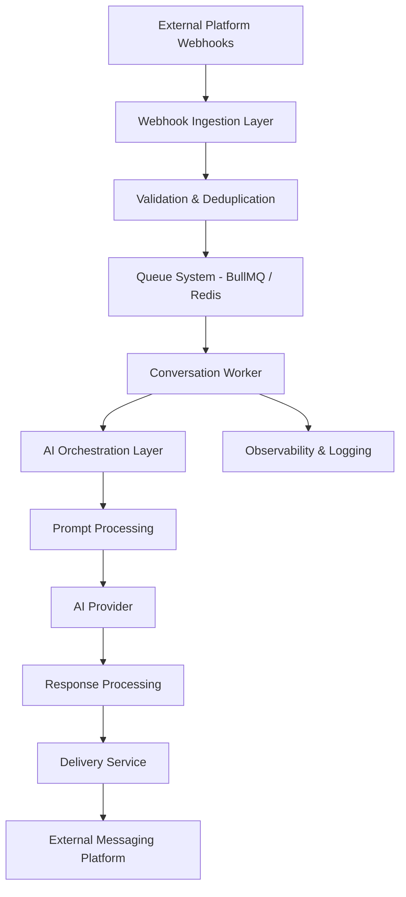

# 🤖 AI Automation System Design

Scalable AI automation architecture featuring distributed workers, queue-driven processing, webhook ingestion, orchestration workflows, and production-grade SaaS infrastructure patterns.

---

# 🧠 Overview

This repository showcases the architecture and engineering patterns behind modern AI-driven automation systems designed for scalability, reliability, and production-grade operations.

The system focuses on:

- Distributed queue & worker orchestration
- AI response pipelines
- Webhook ingestion architecture
- Retry & idempotency strategies
- Multi-step automation workflows
- Observability & operational reliability
- Event-driven backend systems

This project is architecture-focused and demonstrates generalized production-inspired patterns without exposing proprietary business logic or private client systems.

---

# ⚙️ System Architecture



---

# 🚀 Core Engineering Concepts

## 📦 Queue-Driven Processing
The system uses asynchronous queue workers to process conversations independently and improve scalability under high throughput.

Key benefits:
- Improved reliability
- Horizontal scalability
- Failure isolation
- Retry handling
- Rate limiting support

---

## 🧠 AI Orchestration
AI processing is separated into dedicated orchestration layers responsible for:

- Prompt construction
- Context management
- Conversation state handling
- Provider routing
- Response validation
- Fallback strategies

---

## 🔄 Idempotency & Retry Safety
Production systems must handle:
- duplicate webhook deliveries
- worker restarts
- retry collisions
- partial failures

The architecture uses idempotency patterns to ensure safe retry behavior and predictable state transitions.

---

## 📈 Observability
Operational visibility is critical for automation systems.

The architecture includes:
- structured logging
- worker monitoring
- queue metrics
- failure tracking
- processing visibility
- event tracing

---

# 🏗️ Infrastructure Stack

| Layer | Technology |
|---|---|
| Frontend | Next.js |
| Backend | Node.js + TypeScript |
| Database | PostgreSQL |
| Queue System | BullMQ + Redis |
| AI Providers | OpenAI / Gemini |
| Deployment | Fly.io |
| Observability | Structured Logging & Metrics |

---

# 📂 Repository Structure

```txt
architecture/
├── system-overview.md
├── queue-processing.md
├── ai-orchestration.md
├── observability.md
└── scaling-patterns.md

docs/
├── deployment.md
├── rate-limiting.md
└── idempotency.md

examples/
├── webhook-handler.ts
├── queue-worker.ts
├── retry-strategy.ts
└── orchestration-flow.ts

diagrams/
├── system-architecture.png
├── queue-flow.png
├── ai-pipeline.png
└── database-design.png
```

---

# ⚡ Engineering Focus Areas

This repository focuses heavily on:

- Distributed systems thinking
- Scalable queue orchestration
- Event-driven architectures
- AI workflow management
- Production-grade backend engineering
- SaaS infrastructure patterns
- Reliability & operational resilience

---

# 🔮 Future Improvements

Potential future areas include:

- Multi-provider AI routing
- Distributed tracing
- Advanced caching layers
- Multi-tenant orchestration
- Agent-based workflow systems
- Real-time monitoring dashboards
- AI workflow simulation environments

---

# 🤝 Contributions

This repository is intended as an architecture showcase and engineering reference for scalable AI-native backend systems and automation platforms.

---

# 📜 License

MIT