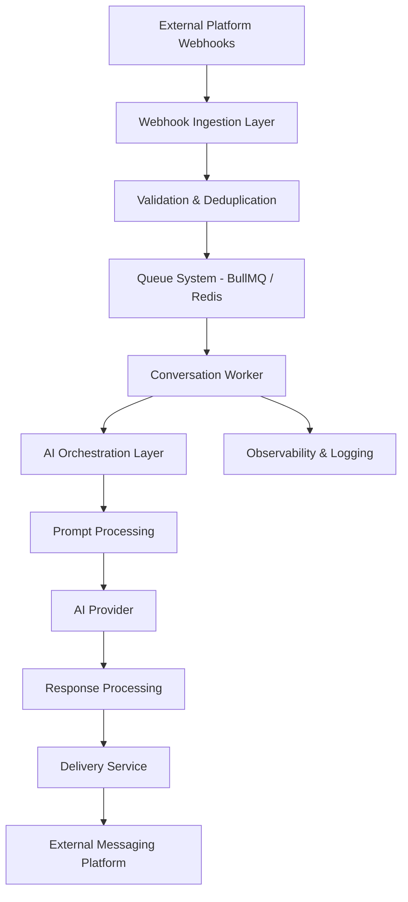

<p align="center">
  
</p>

# 🤖 AI Automation System Design

> Production-inspired architecture showcase for scalable AI-native automation systems and distributed SaaS infrastructure.

Scalable AI automation architecture featuring distributed workers, queue-driven processing, webhook ingestion, orchestration workflows, and production-grade SaaS infrastructure patterns.

---

# 🧠 Overview

This repository showcases the architecture and engineering patterns behind modern AI-driven automation systems designed for scalability, reliability, and production-grade operations.

<p align="left">


</p>

The system focuses on:

- Distributed queue & worker orchestration
- AI response pipelines
- Webhook ingestion architecture
- Retry & idempotency strategies
- Multi-step automation workflows
- Observability & operational reliability
- Event-driven backend systems

This project is architecture-focused and demonstrates generalized production-inspired patterns without exposing proprietary business logic or private client systems.

---

# ⚙️ System Architecture

## 📊 Architecture Diagrams

- [🏗️ System Architecture](./diagrams/system-architecture.md)
- [📦 Queue Processing Flow](./diagrams/queue-processing.md)
- [🧠 AI Orchestration Flow](./diagrams/ai-orchestration.md)
- [🗄️ Database Relationships](./diagrams/database-design.md)



---

# 🚀 Core Engineering Concepts

## 📦 Queue-Driven Processing

The system uses asynchronous queue workers to process conversations independently and improve scalability under high throughput.

### Key Benefits

- Improved reliability
- Horizontal scalability
- Failure isolation
- Retry handling
- Rate limiting support

---

## 🧠 AI Orchestration

AI processing is separated into dedicated orchestration layers responsible for:

- Prompt construction
- Context management
- Conversation state handling
- Provider routing
- Response validation
- Fallback strategies

---

## 🔄 Idempotency & Retry Safety

Production systems must handle:

- Duplicate webhook deliveries
- Worker restarts
- Retry collisions
- Partial failures

The architecture uses idempotency patterns to ensure safe retry behavior and predictable state transitions.

---

## 📈 Observability

Operational visibility is critical for automation systems.

The architecture includes:

- Structured logging
- Worker monitoring
- Queue metrics
- Failure tracking
- Processing visibility
- Event tracing

---

# 🔥 Key Engineering Concepts

This repository explores modern backend engineering patterns including:

- Distributed queue orchestration
- Event-driven architectures
- Retry-safe workflows
- AI orchestration systems
- Webhook ingestion pipelines
- Worker isolation patterns
- Observability & monitoring
- Horizontal scalability
- Idempotent processing
- Production-grade SaaS infrastructure

---

# 🏗️ Infrastructure Stack

| Layer | Technology |
|---|---|
| Frontend | Next.js |
| Backend | Node.js + TypeScript |
| Database | PostgreSQL |
| Queue System | BullMQ + Redis |
| AI Providers | OpenAI / Gemini |
| Deployment | Fly.io |
| Observability | Structured Logging & Metrics |

---

# 📂 Repository Structure

```txt
architecture/
├── system-overview.md
├── queue-processing.md
├── ai-orchestration.md
├── observability.md
└── scaling-patterns.md

docs/
├── deployment.md
├── rate-limiting.md
└── idempotency.md

examples/
├── webhook-handler.ts
├── queue-worker.ts
├── retry-strategy.ts
└── orchestration-flow.ts

diagrams/
├── system-architecture.md
├── queue-processing.md
├── ai-orchestration.md
└── database-design.md
```

---

# ⚡ Engineering Focus Areas

This repository focuses heavily on:

- Distributed systems thinking
- Scalable queue orchestration
- Event-driven architectures
- AI workflow management
- Production-grade backend engineering
- SaaS infrastructure patterns
- Reliability & operational resilience

---

# 🧩 Engineering Principles

The architecture prioritizes:

- Scalability-first design
- Queue-driven processing
- Fault isolation
- Operational visibility
- Idempotent workflows
- Distributed worker systems
- Production reliability
- Modular infrastructure patterns

---

# 🔮 Future Improvements

Potential future areas include:

- Multi-provider AI routing
- Distributed tracing
- Advanced caching layers
- Multi-tenant orchestration
- Agent-based workflow systems
- Real-time monitoring dashboards
- AI workflow simulation environments

---

# 🤝 Contributions

This repository is intended as an architecture showcase and engineering reference for scalable AI-native backend systems and automation platforms.

---

# 📜 License

MIT