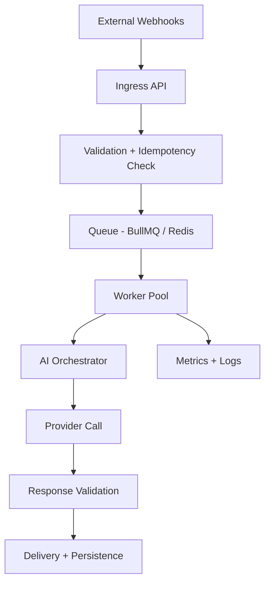

<p align="center">
  
</p>

<p align="center">
  
  
  
  
</p>

<p align="center">
  Production-inspired architecture showcase for scalable AI-native automation systems.
</p>

---

# 🧠 Overview

This repository demonstrates how to design reliable AI-enabled backend workflows with:

- webhook ingestion and normalization
- idempotent queue processing
- retry-safe worker orchestration
- provider-agnostic AI execution
- operational observability and failure handling

The focus is architecture and systems thinking, not a full application build. All patterns are generalized and NDA-safe.

<p align="center">
  
</p>

<p align="center">
  
  
  
</p>

<p align="center">
  
  
  
  
  
</p>


# ⚡ Quick Navigation

- [📸 Product UI Snapshots](#-product-ui-snapshots-nda-safe)
- [🏗️ Architecture at a Glance](#️-architecture-at-a-glance)
- [⚙️ Operational Constraints](#️-operational-constraints)
- [⚖️ Design Trade-offs](#️-design-trade-offs)
- [🛡️ Reliability and Failure Handling](#️-reliability-and-failure-handling)
- [🧩 Implementation Examples](#-implementation-examples)
- [📂 Repository Structure](#-repository-structure)
- [🚀 Stack](#-stack)


# 📸 Product UI Snapshots (NDA-Safe)

These screenshots provide product context for the architecture patterns demonstrated in this repository.

All examples are intentionally sanitized and blurred to avoid exposing:
- customer information
- operational metrics
- internal credentials
- proprietary business logic

## 🖥️ Operational Dashboard Preview

<p align="center">
  
</p>

<p align="center">
  <i>
    Operational control center for AI workflow orchestration, runtime visibility, queue monitoring, infrastructure governance, and alerting systems.
  </i>
</p>

---

## 📦 Queue & Runtime Monitoring

<p align="center">
  
</p>

<p align="center">
  <i>
    Queue orchestration and runtime diagnostics interface for monitoring worker execution, retries, failures, queue health, and operational visibility.
  </i>
</p>


# 🏗️ Architecture at a Glance

Core workflow:

1. Ingest webhook events and acknowledge quickly
2. Validate and deduplicate with idempotency keys
3. Enqueue normalized jobs for async processing
4. Process workloads with bounded worker concurrency
5. Route requests through AI orchestration layers
6. Validate responses and persist state transitions
7. Emit structured telemetry for observability



## 📊 Detailed Architecture Diagrams

- [🏗️ System Architecture](./diagrams/system-architecture.md)
- [📦 Queue Processing Flow](./diagrams/queue-processing.md)
- [🧠 AI Orchestration Flow](./diagrams/ai-orchestration.md)
- [🗄️ Database Relationships](./diagrams/database-design.md)


# ⚙️ Operational Constraints

This architecture assumes realistic production constraints:

- at-least-once webhook delivery
- duplicate event retries
- provider/API rate limits
- variable AI latency
- transient infrastructure failures
- worker crashes and restarts
- bounded queue throughput

## 🎯 Design Priorities

- fast ingress acknowledgement
- retry-safe execution
- idempotent state transitions
- dead-letter queue isolation
- explicit failure categorization
- observability-first operations


# ⚖️ Design Trade-offs

See [architecture/design-tradeoffs.md](./architecture/design-tradeoffs.md)

### Key Trade-offs

| Trade-off | Benefit | Cost |
|---|---|---|
| Queue-driven processing | Reliability & isolation | Higher latency |
| Provider abstraction | Multi-provider flexibility | Integration complexity |
| Conservative retry caps | Controlled infrastructure spend | Reduced retry persistence |
| Strict validation | Fewer downstream failures | Increased processing overhead |


# 🛡️ Reliability and Failure Handling

## Included Reliability Patterns

- [🔄 Idempotency Strategy](./docs/idempotency.md)
- [🚦 Rate Limiting Strategy](./docs/rate-limiting.md)
- [💥 Failure Modes & Mitigations](./docs/failure-modes.md)

### Reliability Focus Areas

- retry-safe workflows
- dead-letter queue handling
- bounded retries
- queue isolation
- operational resilience
- provider fallback handling
- structured error categorization


# 🧩 Implementation Examples

Minimal production-inspired examples focused on architecture realism:

| Example | Purpose |
|---|---|
| [Webhook Handler](./examples/webhook-handler.ts) | Validation, dedupe, queue publishing |
| [Queue Worker](./examples/queue-worker.ts) | Worker execution lifecycle & retry classification |
| [Retry Strategy](./examples/retry-strategy.ts) | Exponential backoff, retry budgets, jitter |


# 📂 Repository Structure

```txt
architecture/
├── system-overview.md
├── queue-processing.md
├── ai-orchestration.md
├── observability.md
└── design-tradeoffs.md

docs/
├── idempotency.md
├── rate-limiting.md
└── failure-modes.md

examples/
├── webhook-handler.ts
├── queue-worker.ts
└── retry-strategy.ts

diagrams/
├── system-architecture.md
├── queue-processing.md
├── ai-orchestration.md
└── database-design.md
```


# 🚀 Stack

### Backend & Infrastructure

- TypeScript
- Node.js
- PostgreSQL
- Redis
- BullMQ

### AI & Orchestration

- OpenAI
- Gemini
- Provider-agnostic orchestration patterns

### Deployment & Observability

- Fly.io
- Structured logging
- Metrics pipelines
- Queue observability


# 👀 How to Review This Repo Quickly

For recruiters, founders, or interviewers:

1. Read the overview and operational constraints
2. Review architecture diagrams and queue flows
3. Review design trade-offs and reliability docs
4. Explore implementation examples
5. Evaluate systems-thinking and operational maturity


<p align="center">
  Built with a systems-first mindset focused on scalability, reliability, and operational resilience.
</p>

# 📜 License

MIT