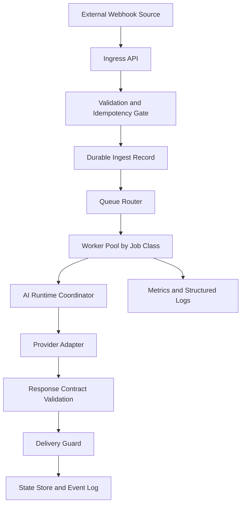
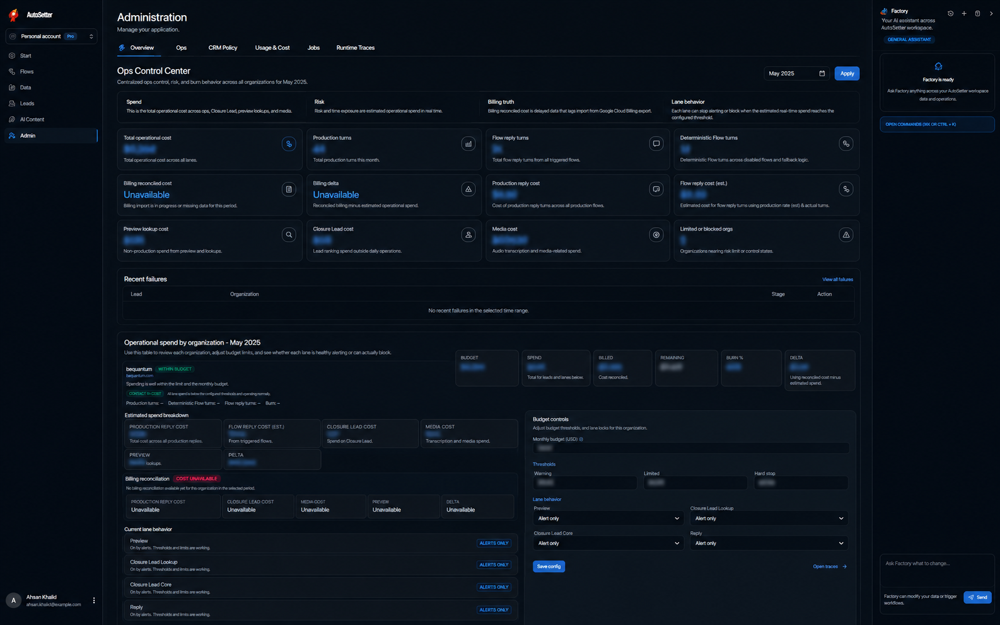
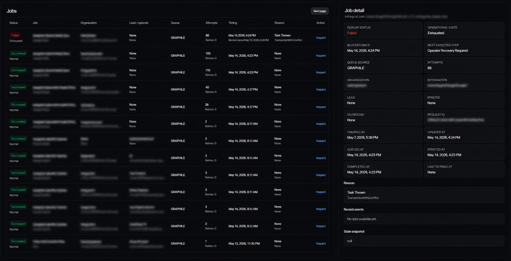

<p align="center">
  
</p>

<p align="center">
  
  
  
  
</p>

<p align="center">
  
  
  
  
  
</p>

# AI Automation System Design

Production-inspired architecture patterns for AI-driven messaging and automation backends.

This repository focuses on operational design, not proprietary implementation details. It documents generalized patterns for queue orchestration, distributed workers, AI runtime coordination, and reliability engineering in event-driven systems.

## Production System Context

The concepts in this repository are inspired by patterns used in real AI automation products, including [AutoSetter](https://www.autosetter.ai), and then generalized for public sharing.

What this means:

- no internal prompts
- no customer data
- no private APIs
- no proprietary workflow logic
- no infrastructure secrets or topology specifics

## What This Repo Models

- fast webhook ingestion with durable handoff to async pipelines
- idempotent execution across ingress, worker retries, and outbound delivery
- queue-driven workload isolation by lane and criticality
- distributed worker systems with explicit concurrency and retry boundaries
- provider-agnostic AI orchestration with validation contracts
- operational observability with reason codes and correlation identifiers
- runtime guardrails for cost, throughput, and failure domains

## Real-World Execution Detail (Generalized)

These are the kinds of runtime signals real teams operate on daily:

- ingress acknowledgement latency and duplicate webhook hit rate
- queue depth + oldest-job age per lane (reply, scheduler, recovery)
- worker claim saturation and retry pressure by error class
- delivery outcomes split by `delivered`, `deferred`, `failed`, `dead_lettered`
- provider health split by throttling (`429`), timeout, and transient transport errors
- acceptance-unknown paths that require recovery checks instead of blind resend
- estimated runtime spend by lane, with separate delayed billing reconciliation

Representative production-style reliability practices shown in this repo:

- bounded retries with exponential backoff + jitter
- explicit non-retryable classification for poison jobs
- durable side-effect checkpoints before/after outbound actions
- dead-letter isolation with operator triage vocabulary
- re-validation of lead/conversation state at worker execution time

## Architecture At A Glance

1. Receive webhook and acknowledge quickly.
2. Validate payload and derive a stable idempotency key.
3. Persist ingest intent and enqueue normalized job.
4. Claim job in bounded worker pools.
5. Assemble runtime context and execute AI orchestration.
6. Validate response and pass through delivery guardrails.
7. Persist state transitions and emit operational events.



## Operational Dashboard Screenshots (NDA-Safe)

Screenshots are sanitized and used only to explain operating workflows, not to disclose private system internals.

### Automation Operations Dashboard

<p align="center">
  
</p>

This view represents how operators monitor:

- automation lane health (reply, observe, scheduling)
- execution outcomes by reason code
- blocked versus delivered actions
- operational interventions and retry pressure

### Queue and Runtime Monitoring

<p align="center">
  
</p>

This view represents how teams operate asynchronous execution:

- queue depth and oldest-job age
- retryable versus terminal failures
- dead-letter growth and triage backlog
- worker concurrency saturation by queue class

## Reliability Patterns

- [Idempotency Strategy](./docs/idempotency.md)
- [Rate Limiting Strategy](./docs/rate-limiting.md)
- [Failure Modes and Mitigations](./docs/failure-modes.md)

Key principles:

- at-least-once safe processing
- bounded retries with jitter
- dead-letter isolation for poison jobs
- explicit error classification
- deterministic state transitions

## Architecture Docs

- [System Overview](./architecture/system-overview.md)
- [Queue Processing](./architecture/queue-processing.md)
- [AI Orchestration](./architecture/ai-orchestration.md)
- [Observability](./architecture/observability.md)
- [Design Trade-offs](./architecture/design-tradeoffs.md)

## Diagrams

- [System Architecture Diagram](./diagrams/system-architecture.md)
- [Queue Processing Diagram](./diagrams/queue-processing.md)
- [AI Orchestration Diagram](./diagrams/ai-orchestration.md)
- [Database Relationship Diagram](./diagrams/database-design.md)

## Implementation Examples

- [Webhook Handler](./examples/webhook-handler.ts): ingress validation, dedupe, and durable enqueue intent
- [Queue Worker](./examples/queue-worker.ts): job claiming, retry classification, and delivery checkpointing
- [Retry Strategy](./examples/retry-strategy.ts): bounded exponential backoff with jitter and retry budget controls

## Repository Layout

```txt
architecture/
docs/
diagrams/
examples/
assets/
```

## Stack Assumptions

- TypeScript / Node.js
- Redis-backed queueing
- PostgreSQL state storage
- provider abstraction for AI execution
- metrics + structured logs for operational telemetry

## License

MIT

