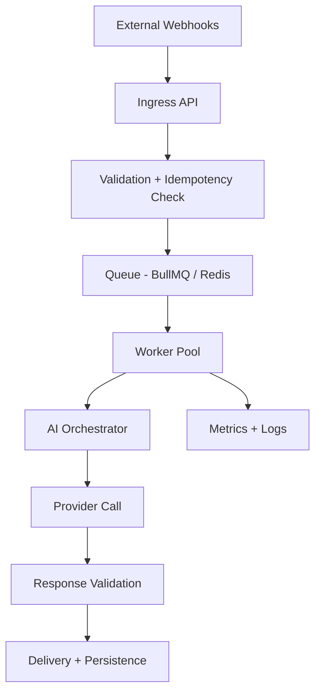

# AI Automation System Design


Production-inspired architecture showcase for queue-driven AI automation systems.


## Overview

This repository demonstrates how to design reliable AI-enabled backend workflows with:

- webhook ingestion and normalization
- idempotent queue processing
- retry-safe worker orchestration
- provider-agnostic AI execution
- operational observability and failure handling

The focus is architecture and systems thinking, not a full application build. All patterns are generalized and NDA-safe.

## Quick Navigation

- [Architecture at a Glance](#architecture-at-a-glance)
- [Operational Constraints](#operational-constraints)
- [Design Trade-offs](#design-trade-offs)
- [Reliability and Failure Handling](#reliability-and-failure-handling)
- [Implementation Examples](#implementation-examples)
- [How to Review This Repo Quickly](#how-to-review-this-repo-quickly)

## Architecture at a Glance

Core flow:

1. Ingest webhook events and acknowledge quickly.
2. Validate and deduplicate by idempotency key.
3. Enqueue normalized jobs for async processing.
4. Process with worker concurrency limits and retry policy.
5. Route through AI orchestration and response validation.
6. Deliver results and persist state transitions.
7. Emit structured telemetry for queue, worker, and provider behavior.



Detailed diagrams:

- [System Architecture](./diagrams/system-architecture.md)
- [Queue Processing Flow](./diagrams/queue-processing.md)
- [AI Orchestration Flow](./diagrams/ai-orchestration.md)
- [Database Relationships](./diagrams/database-design.md)

## Operational Constraints

This architecture assumes realistic constraints:

- at-least-once webhook delivery (duplicates are expected)
- provider/API rate limits and variable latency
- worker crashes and restarts
- transient infrastructure faults (timeouts, 429s, network errors)
- bounded queue throughput per worker group

Design priorities:

- fast ingress acknowledgement
- idempotent state transitions
- bounded retries with dead-letter handoff
- explicit failure categorization
- observability around queue depth, retry rate, and saturation

## Design Trade-offs

See [architecture/design-tradeoffs.md](./architecture/design-tradeoffs.md) for details. Key trade-offs:

- higher queue latency in exchange for reliability and isolation
- stricter validation in exchange for fewer downstream failures
- provider abstraction flexibility in exchange for integration complexity
- conservative retry caps in exchange for controlled infrastructure spend

## Reliability and Failure Handling

- [Idempotency Strategy](./docs/idempotency.md)
- [Rate Limiting Strategy](./docs/rate-limiting.md)
- [Failure Modes and Mitigations](./docs/failure-modes.md)

## Implementation Examples

Minimal examples with production-inspired behavior:

- [Webhook Handler](./examples/webhook-handler.ts): validation, dedupe keying, queue enqueue metadata
- [Queue Worker](./examples/queue-worker.ts): retriable vs non-retriable classification and dead-letter handoff
- [Retry Strategy](./examples/retry-strategy.ts): exponential backoff with jitter and retry budget

## Repository Structure

```txt
architecture/
├── system-overview.md
├── queue-processing.md
├── ai-orchestration.md
├── observability.md
└── design-tradeoffs.md

docs/
├── idempotency.md
├── rate-limiting.md
└── failure-modes.md

examples/
├── webhook-handler.ts
├── queue-worker.ts
└── retry-strategy.ts

diagrams/
├── system-architecture.md
├── queue-processing.md
├── ai-orchestration.md
└── database-design.md
```

## How to Review This Repo Quickly

For interviewers or hiring managers:

1. Read this README for system boundaries and constraints.
2. Review `diagrams/` for end-to-end flow.
3. Review `architecture/design-tradeoffs.md` for decision quality.
4. Review `docs/failure-modes.md` and `docs/idempotency.md` for reliability thinking.
5. Review `examples/` for implementation realism.

## Stack

- TypeScript / Node.js
- PostgreSQL
- Redis + BullMQ
- OpenAI / Gemini (provider-agnostic orchestration pattern)
- Structured logs and metrics

## License

MIT
