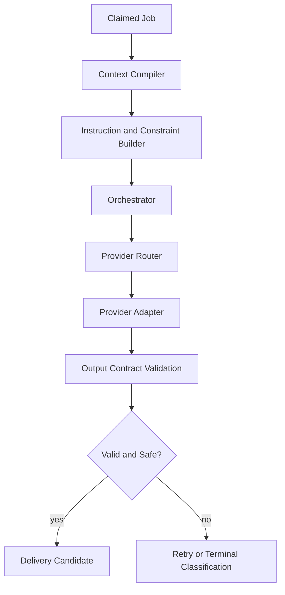

# AI Orchestration

The AI orchestration layer coordinates context, provider execution, and response safety checks. It does not own queueing, persistence, or delivery policy.

## Orchestration Responsibilities

- compile deterministic context for each execution
- map runtime lane to provider strategy
- invoke provider adapters through a normalized contract
- validate model output before it can trigger side effects
- emit explicit reason codes for failures and skips

## Runtime Coordination Pattern

## Provider Abstraction Contract

A practical abstraction stays small and explicit:

- input envelope (messages, metadata, limits)
- output schema (text/tool actions/structured fields)
- error model (retryable, non-retryable, ambiguous)
- telemetry envelope (latency, token usage, request id)

## Reliability Concerns

- provider timeouts can be acceptance-unknown states
- retries must not create duplicate outbound actions
- fallbacks should preserve output contract compatibility
- policy checks run after generation, before delivery

## Conversation and Lead State Coordination

A job should execute from a persisted state snapshot, not from UI assumptions. Conversation state, lead state, and automation mode should be revalidated at execution time to prevent stale side effects.

## Cost and Throughput Controls

- cap max attempts per orchestration run
- bound model tokens and tool steps per job
- track estimated spend by lane for operational guardrails
- separate realtime estimated cost from delayed billing reconciliation
