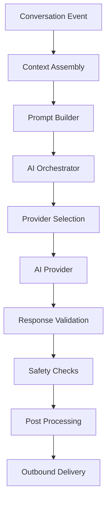

# 🧠 AI Orchestration Architecture

This document explains the orchestration layer responsible for managing AI-driven workflows, prompt execution, and conversation processing.

---

# ⚡ Purpose of the Orchestration Layer

The orchestration layer separates AI logic from infrastructure concerns and provides:

- prompt lifecycle management
- context assembly
- provider routing
- response validation
- conversation state management
- retry-safe execution

---

# 🌐 AI Processing Flow

---

# 🧩 Core Components

## Context Assembly
Responsible for:
- conversation history
- lead state
- automation context
- memory retrieval
- workflow state

---

## Prompt Builder
Handles:
- structured prompt generation
- template composition
- AI instructions
- contextual augmentation

---

## Provider Routing
Supports:
- fallback providers
- latency optimization
- cost-aware routing
- provider abstraction

---

## Response Validation
Ensures:
- valid outputs
- workflow safety
- structured formatting
- retry-safe responses

---

# 🔄 Reliability Patterns

The orchestration layer is designed around:

- idempotent execution
- retry-safe workflows
- queue isolation
- async processing
- state consistency

---

# 📈 Scalability Considerations

The architecture supports:
- multiple AI providers
- distributed workers
- queue-based execution
- provider failover
- horizontal scaling