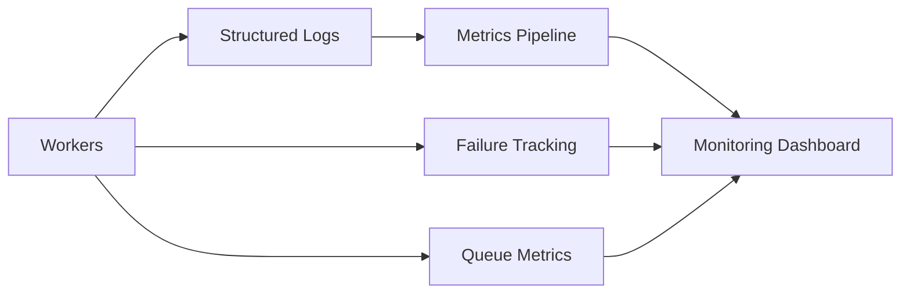

# 📈 Observability & Monitoring

Reliable automation systems require deep operational visibility into queues, workers, AI processing, and delivery pipelines.

---

# ⚡ Goals

The observability layer provides:

- worker visibility
- queue monitoring
- structured logging
- retry tracking
- failure analysis
- operational diagnostics

---

# 🌐 Monitoring Flow

---

# 🧠 Key Monitoring Areas

## Queue Monitoring
Tracks:
- queue latency
- retry counts
- failed jobs
- worker throughput
- backlog pressure

---

## AI Processing Metrics
Measures:
- response latency
- provider reliability
- token usage
- orchestration failures
- processing duration

---

## Worker Health
Monitors:
- worker crashes
- memory usage
- processing failures
- concurrency bottlenecks

---

# 🔄 Reliability Engineering

The system includes:
- retry visibility
- dead-letter handling
- structured event logging
- error categorization
- operational tracing

---

# 🚀 Production Engineering Goals

The architecture prioritizes:

- operational resilience
- fault isolation
- scalability
- monitoring visibility
- production stability