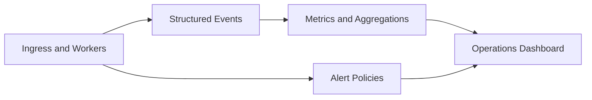

# Observability

Operational observability in automation systems is about explainability, not just logs volume.

## Production System Context

The observability conventions here are generalized from operating real AI automation runtimes (for example [AutoSetter](https://www.autosetter.ai)) and are intentionally abstracted to stay NDA-safe.

## Observability Principles

- every significant state transition has a reason code
- every execution path has correlation ids
- dashboards read from durable state and event logs
- external monitoring is correlation radar, not source-of-truth business state

## Truth Layers

1. **Execution truth**: job events, transition checkpoints, provider outcomes
2. **Operational truth**: queue health, worker saturation, retry/dead-letter trends
3. **Cost truth**: realtime estimated spend and delayed billing reconciliation

## Telemetry Flow

## Minimum Dashboard Views

- queue depth, age, and retry pressure by lane
- worker claim latency and saturation
- outcome breakdown (delivered, skipped, deferred, failed)
- dead-letter backlog and oldest unresolved age
- provider latency/error class and fallback rates
- estimated cost by lane and organization

## Logging Policy

Log structured metadata and reason codes. Avoid sending raw sensitive payloads to external telemetry systems.

Prefer:

- ids and correlation keys
- enum reason codes
- durations and counters
- lane and queue names

Avoid:

- raw message content
- prompts or provider request bodies
- signed URLs, tokens, secrets, or customer PII

## Alerting Guidance

Alert on sustained operational risk, not single noisy events:

- oldest-job age breaches
- dead-letter growth acceleration
- retryable error ratio spikes
- provider outage thresholds
- worker crash loops
