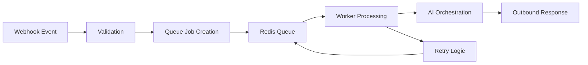

# 📦 Queue Processing Architecture

The system uses queue-driven processing to improve scalability, reliability, and operational resilience.

---

# ⚡ Why Queue Processing?

Direct synchronous processing creates problems such as:

- webhook timeouts
- retry collisions
- scaling bottlenecks
- poor failure isolation

Queue systems decouple ingestion from execution.

---

# 🔄 Queue Workflow

---

# 🧠 Worker Responsibilities

Workers handle:

- conversation processing
- AI generation
- retry handling
- rate limiting
- workflow orchestration
- delivery retries

---

# 🔁 Retry Strategy

The architecture uses:
- exponential backoff
- dead-letter patterns
- retry caps
- idempotent execution

This improves reliability under unstable conditions.

---

# 📈 Scalability Benefits

Queue-driven systems enable:

- horizontal scaling
- workload distribution
- async processing
- failure isolation
- operational visibility