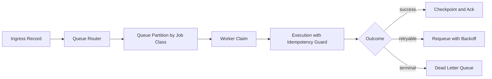

# Queue Processing

Queueing is the core control plane for asynchronous automation execution.

## Why Queue-Driven Design

Synchronous webhook handling couples upstream latency to downstream AI and provider behavior. A queue boundary allows the system to:

- acknowledge webhook deliveries quickly
- absorb burst traffic without immediate overload
- execute retries without blocking ingress
- isolate failures by lane and error class

## Queue Classes

A production-style system usually separates queues by execution profile:

- **conversation queue**: user-facing reply and delivery actions
- **scheduler queue**: delayed follow-up and timed automation events
- **recovery queue**: reconciliation and acceptance-unknown checks
- **dead-letter queue**: terminal failures needing operator triage

## Worker Execution Contract

Workers should process jobs with an explicit lifecycle:

1. claim job with concurrency guard
2. load execution context snapshot
3. classify retryability and policy constraints
4. execute bounded side effects
5. checkpoint outcome with reason code
6. ack, retry, or dead-letter

## Queue-to-Worker Flow

## Concurrency and Backpressure

Concurrency is controlled at multiple levels:

- queue-level max active jobs
- worker process concurrency
- provider call budgets per provider/model
- per-tenant fairness caps when needed

When pressure rises, the system should degrade predictably (delay/requeue/dead-letter) rather than produce silent drops.

## Operational Signals

- queue depth per lane
- oldest-job age per lane
- claim wait time
- retries by error class
- dead-letter inflow and unresolved age
- worker saturation against configured caps
