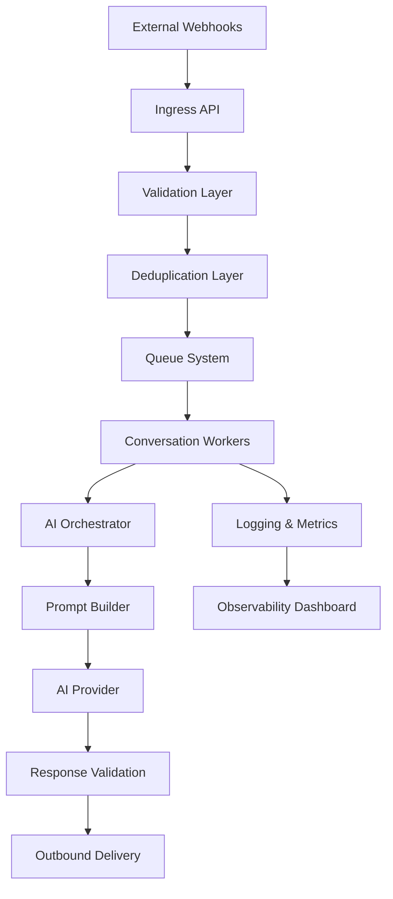

# 🏗️ System Overview

This document explains the high-level architecture behind the AI automation platform.

---

# ⚡ Core Goals

The system is designed around:

- Scalability
- Reliability
- Queue-driven processing
- AI orchestration
- Failure isolation
- Operational visibility
- Distributed workloads

---

# 🌐 High-Level Architecture

---

# 📦 Core Components

## Webhook Ingestion Layer
Responsible for:
- receiving external events
- request validation
- deduplication
- event normalization

---

## Queue System
Handles:
- asynchronous processing
- retry management
- failure isolation
- rate limiting
- concurrency control

---

## AI Orchestration Layer
Responsible for:
- prompt generation
- context assembly
- provider routing
- response validation
- conversation state handling

---

## Worker Layer
Workers independently process:
- conversations
- automation workflows
- retries
- scheduled tasks

This enables horizontal scaling across workloads.

---

## Observability Layer
Provides:
- structured logging
- worker metrics
- failure tracking
- queue monitoring
- operational visibility