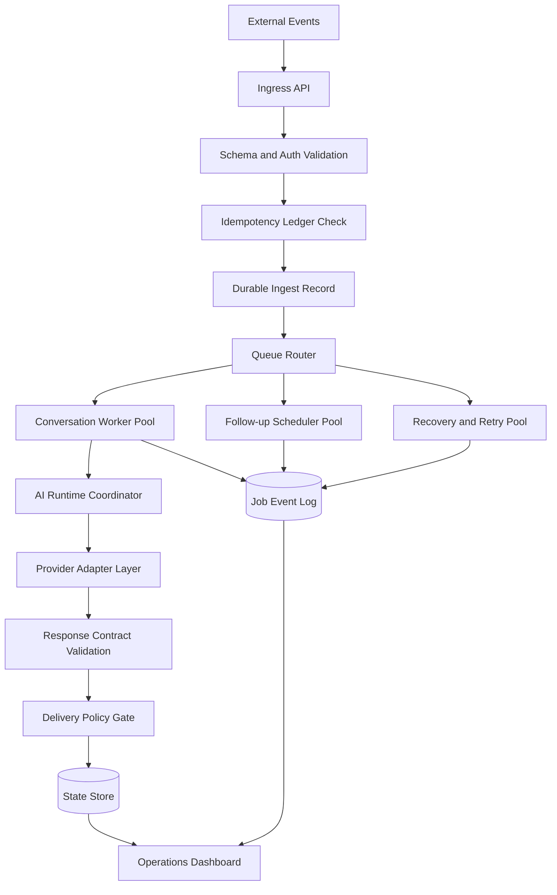

# System Overview

This architecture models a production-style AI automation backend for event-driven messaging workflows.

It is optimized for reliability under at-least-once delivery, provider variability, and distributed worker execution.

## Production System Context

The patterns in this document are generalized from real AI automation operations, including public product context from [AutoSetter](https://www.autosetter.ai), and intentionally exclude proprietary implementation details.

## System Objectives

- acknowledge inbound webhooks quickly
- make async execution recoverable after partial failures
- keep side effects idempotent across retries
- enforce clear ownership boundaries between lanes
- expose operational truth through queryable state and reason-coded events

## Runtime Boundaries

- **Ingress boundary**: validates, normalizes, records durable ingest intent, and returns fast acknowledgement.
- **Queue boundary**: separates external delivery cadence from internal execution cadence.
- **Worker boundary**: executes jobs with explicit concurrency and claim semantics.
- **AI runtime boundary**: compiles context, selects provider strategy, validates outputs.
- **Delivery boundary**: performs final policy checks before outbound side effects.
- **Observability boundary**: emits structured events for every state transition and decision.

## Execution Flow

## Operational Assumptions

- upstream webhook sources may retry aggressively
- queue processing is at-least-once, not exactly-once
- provider calls can fail with ambiguous outcomes (timeout, 429, 5xx)
- workers can crash after partial side effects
- system behavior must remain auditable per lead/conversation/job

## Failure Domain Strategy

- isolate queue lanes by workload type and urgency
- route non-retriable payloads directly to dead-letter triage
- keep retry budgets finite to prevent retry storms
- prioritize forward progress over strict low-latency sync execution
- preserve operator intervention paths for ambiguous delivery states
