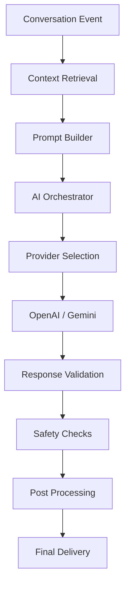

# 🧠 AI Orchestration Flow

```mermaid
flowchart TD

A[Conversation Event]
--> B[Context Retrieval]

B --> C[Prompt Builder]

C --> D[AI Orchestrator]

D --> E[Provider Selection]

E --> F[OpenAI / Gemini]

F --> G[Response Validation]

G --> H[Safety Checks]

H --> I[Post Processing]

I --> J[Final Delivery]
```