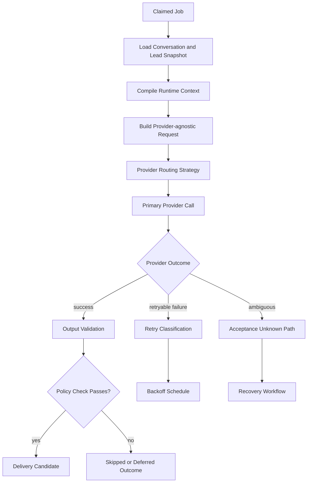

# AI Orchestration Flow

```mermaid
flowchart TD
  A[Claimed Job] --> B[Load Conversation and Lead Snapshot]
  B --> C[Compile Runtime Context]
  C --> D[Build Provider-agnostic Request]
  D --> E[Provider Routing Strategy]
  E --> F[Primary Provider Call]
  F --> G{Provider Outcome}

  G -->|success| H[Output Validation]
  G -->|retryable failure| I[Retry Classification]
  G -->|ambiguous| J[Acceptance Unknown Path]

  H --> K{Policy Check Passes?}
  K -->|yes| L[Delivery Candidate]
  K -->|no| M[Skipped or Deferred Outcome]

  I --> N[Backoff Schedule]
  J --> O[Recovery Workflow]
```
