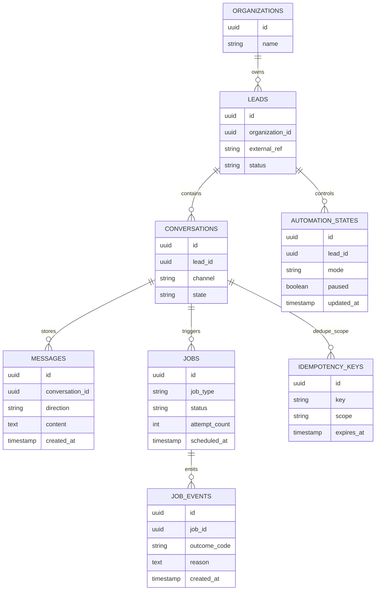

# Database Relationships

```mermaid
erDiagram
  ORGANIZATIONS ||--o{ LEADS : owns
  LEADS ||--o{ CONVERSATIONS : contains
  CONVERSATIONS ||--o{ MESSAGES : stores
  CONVERSATIONS ||--o{ JOBS : triggers
  JOBS ||--o{ JOB_EVENTS : emits
  CONVERSATIONS ||--o{ IDEMPOTENCY_KEYS : dedupe_scope
  LEADS ||--o{ AUTOMATION_STATES : controls

  ORGANIZATIONS {
    uuid id
    string name
  }

  LEADS {
    uuid id
    uuid organization_id
    string external_ref
    string status
  }

  CONVERSATIONS {
    uuid id
    uuid lead_id
    string channel
    string state
  }

  MESSAGES {
    uuid id
    uuid conversation_id
    string direction
    text content
    timestamp created_at
  }

  JOBS {
    uuid id
    string job_type
    string status
    int attempt_count
    timestamp scheduled_at
  }

  JOB_EVENTS {
    uuid id
    uuid job_id
    string outcome_code
    text reason
    timestamp created_at
  }

  IDEMPOTENCY_KEYS {
    uuid id
    string key
    string scope
    timestamp expires_at
  }

  AUTOMATION_STATES {
    uuid id
    uuid lead_id
    string mode
    boolean paused
    timestamp updated_at
  }
```
