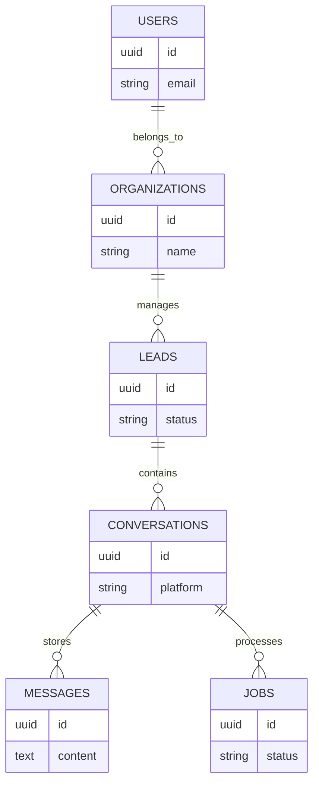

# 🗄️ Database Relationships

```mermaid
erDiagram

USERS ||--o{ ORGANIZATIONS : belongs_to
ORGANIZATIONS ||--o{ LEADS : manages
LEADS ||--o{ CONVERSATIONS : contains
CONVERSATIONS ||--o{ MESSAGES : stores
CONVERSATIONS ||--o{ JOBS : processes

USERS {
  uuid id
  string email
}

ORGANIZATIONS {
  uuid id
  string name
}

LEADS {
  uuid id
  string status
}

CONVERSATIONS {
  uuid id
  string platform
}

MESSAGES {
  uuid id
  text content
}

JOBS {
  uuid id
  string status
}
```