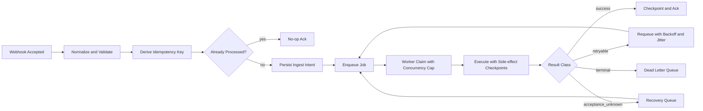

# Queue Processing Flow

```mermaid
flowchart LR
  A[Webhook Accepted] --> B[Normalize and Validate]
  B --> C[Derive Idempotency Key]
  C --> D{Already Processed?}
  D -->|yes| E[No-op Ack]
  D -->|no| F[Persist Ingest Intent]
  F --> G[Enqueue Job]

  G --> H[Worker Claim with Concurrency Cap]
  H --> I[Execute with Side-effect Checkpoints]
  I --> J{Result Class}

  J -->|success| K[Checkpoint and Ack]
  J -->|retryable| L[Requeue with Backoff and Jitter]
  J -->|acceptance_unknown| M[Recovery Queue]
  J -->|terminal| N[Dead Letter Queue]

  L --> G
  M --> G
```
