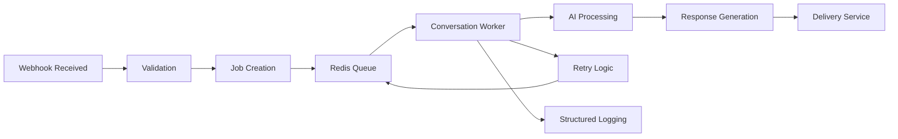

# 📦 Queue Processing Flow

```mermaid
flowchart LR

A[Webhook Received]
--> B[Validation]

B --> C[Job Creation]

C --> D[Redis Queue]

D --> E[Conversation Worker]

E --> F[AI Processing]

F --> G[Response Generation]

G --> H[Delivery Service]

E --> I[Retry Logic]

I --> D

E --> J[Structured Logging]
```