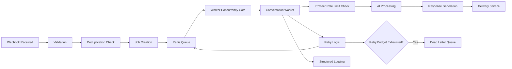

# 📦 Queue Processing Flow

```mermaid
flowchart LR

A[Webhook Received]
--> B[Validation]

B --> C[Deduplication Check]

C --> D[Job Creation]

D --> E[Redis Queue]

E --> F[Worker Concurrency Gate]

F --> G[Conversation Worker]

G --> H[Provider Rate Limit Check]

H --> I[AI Processing]

I --> J[Response Generation]

J --> K[Delivery Service]

G --> L[Retry Logic]

L --> E

L --> M{Retry Budget Exhausted?}

M -->|Yes| N[Dead Letter Queue]

G --> O[Structured Logging]
```
