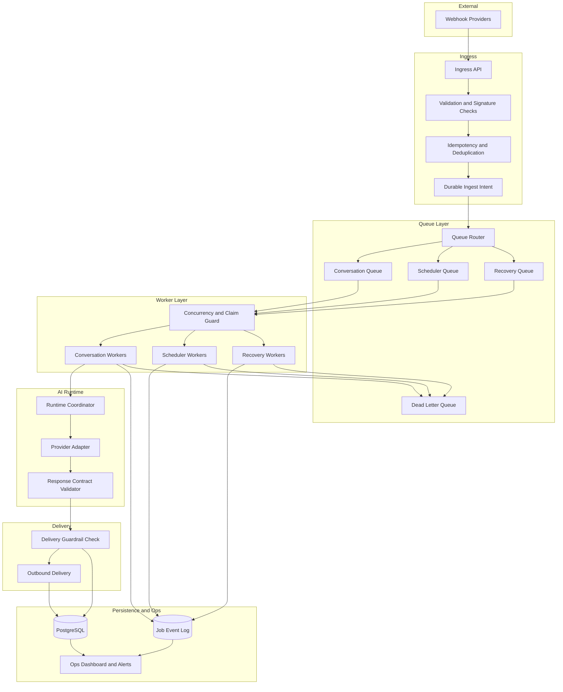

# System Architecture Diagram

```mermaid
flowchart TD
  subgraph External
    A[Webhook Providers]
  end

  subgraph Ingress
    B[Ingress API]
    C[Validation and Signature Checks]
    D[Idempotency and Deduplication]
    E[Durable Ingest Intent]
  end

  subgraph Queue Layer
    F[Queue Router]
    G1[Conversation Queue]
    G2[Scheduler Queue]
    G3[Recovery Queue]
    GX[Dead Letter Queue]
  end

  subgraph Worker Layer
    H1[Conversation Workers]
    H2[Scheduler Workers]
    H3[Recovery Workers]
    HC[Concurrency and Claim Guard]
  end

  subgraph AI Runtime
    I[Runtime Coordinator]
    J[Provider Adapter]
    K[Response Contract Validator]
  end

  subgraph Delivery
    L[Delivery Guardrail Check]
    M[Outbound Delivery]
  end

  subgraph Persistence and Ops
    N[(PostgreSQL)]
    O[(Job Event Log)]
    P[Ops Dashboard and Alerts]
  end

  A --> B
  B --> C --> D --> E --> F
  F --> G1 --> HC --> H1
  F --> G2 --> HC --> H2
  F --> G3 --> HC --> H3

  H1 --> I --> J --> K --> L --> M
  H1 --> O
  H2 --> O
  H3 --> O

  L --> N
  M --> N
  O --> P
  N --> P

  H1 --> GX
  H2 --> GX
  H3 --> GX
```
