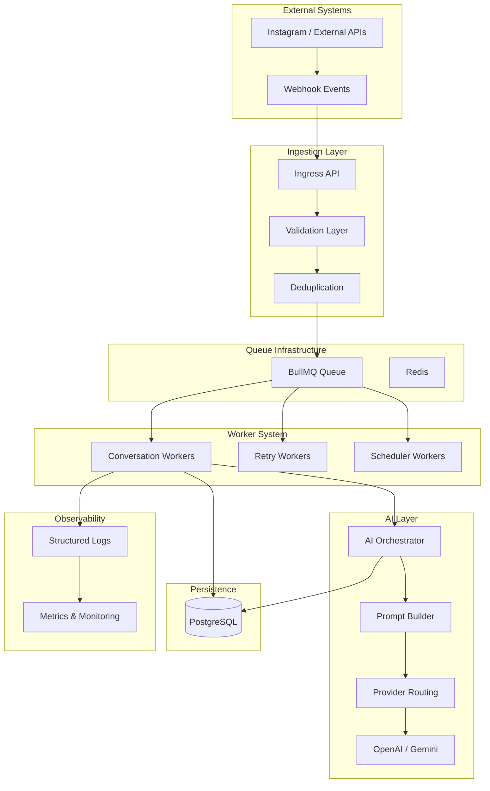

# 🏗️ System Architecture Diagram

```mermaid
flowchart TD

subgraph External Systems
A[Instagram / External APIs]
B[Webhook Events]
end

subgraph Ingestion Layer
C[Ingress API]
D[Validation Layer]
E[Deduplication]
end

subgraph Queue Infrastructure
F[BullMQ Queue]
G[Redis]
end

subgraph Worker System
H[Conversation Workers]
I[Retry Workers]
J[Scheduler Workers]
end

subgraph AI Layer
K[AI Orchestrator]
L[Prompt Builder]
M[Provider Routing]
N[OpenAI / Gemini]
end

subgraph Persistence
O[(PostgreSQL)]
end

subgraph Observability
P[Structured Logs]
Q[Metrics & Monitoring]
end

A --> B
B --> C
C --> D
D --> E
E --> F

F --> H
F --> I
F --> J

H --> K
K --> L
L --> M
M --> N

H --> O
K --> O

H --> P
P --> Q
```