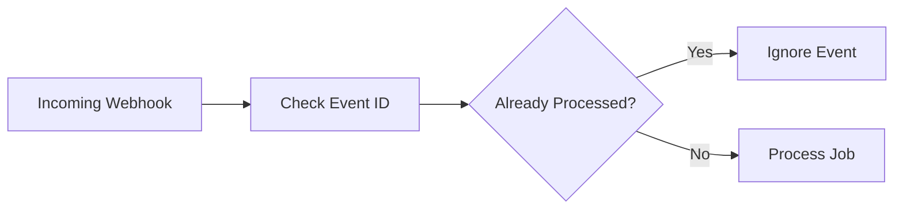

# 🔄 Idempotency Strategy

Reliable automation systems must safely handle duplicate events, retries, and worker restarts.

---

# ⚡ Why Idempotency Matters

External platforms may:
- resend webhook events
- timeout requests
- retry failed deliveries

Without idempotent processing, systems risk:
- duplicate messages
- repeated AI responses
- inconsistent state transitions

---

# 🧠 Strategy

The architecture uses unique event identifiers to ensure jobs are processed only once.

Core techniques include:

- event deduplication
- idempotency keys
- safe retry behavior
- state transition validation

---

# 📦 Example Workflow

---

# 🚀 Reliability Benefits

This approach improves:

- retry safety
- state consistency
- operational reliability
- failure recovery
- distributed worker coordination