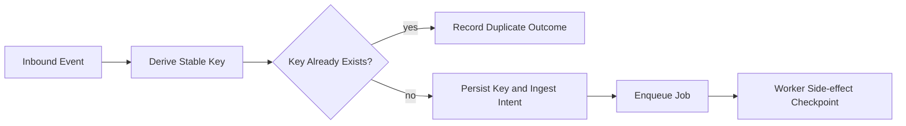

# Idempotency Strategy

At-least-once delivery means duplicates are expected, not exceptional. Idempotency is a first-class runtime contract.

## Objectives

- prevent duplicate side effects under retries and replays
- keep state transitions monotonic
- make duplicate handling explicit and observable

## Where Idempotency Is Enforced

1. **Ingress dedupe**: drop/reclassify repeated external events before enqueue.
2. **Worker checkpoints**: guard every side-effect boundary.
3. **Delivery seam**: ensure one semantic outbound action maps to one durable send identity.

## Key Design Patterns

- deterministic keys derived from stable event identity (`source:eventId`)
- transition guards that only allow forward progression (`queued -> processing -> delivered`)
- durable checkpoint writes before irreversible side effects
- bounded retention for dedupe records to avoid unbounded growth

## Example Flow

## Operational Metrics

Track idempotency behavior as a health signal:

- dedupe hit ratio by event source
- duplicate sends prevented by delivery checkpoint
- idempotency key collision incidents
- replay success rate after worker restart

## Common Pitfalls

- keys derived from non-stable fields (timestamps/random values)
- one broad key scope that blocks unrelated actions
- no expiration policy for key retention
- idempotency only at ingress but not at delivery boundaries
