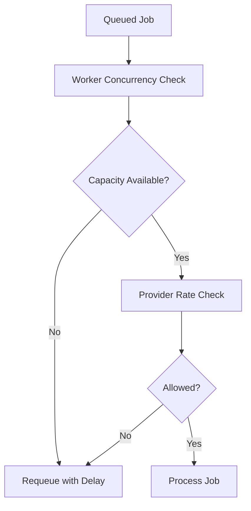

# Rate Limiting Strategy

Rate limiting is applied at multiple boundaries to protect both internal workers and external providers.

## Control Points

1. **Ingress control:** smooth bursty webhook traffic before queue amplification.
2. **Worker concurrency:** cap active jobs per worker group.
3. **Provider calls:** enforce provider-specific limits and retry windows.

## Practical Policy Model

- queue-level max concurrency per job type
- provider token/request budget per time window
- per-tenant fairness caps where relevant
- backoff + jitter after `429`/transient failures

## Example Execution Path

## Operational Constraints

- limits should be explicit, versioned, and observable
- default behavior under saturation should be predictable (delay, shed, or dead-letter)
- throughput targets must be evaluated against provider quotas, not only CPU availability

## Metrics to Watch

- jobs delayed by rate limit
- provider `429` ratio
- queue age under throttling
- worker saturation against configured caps
