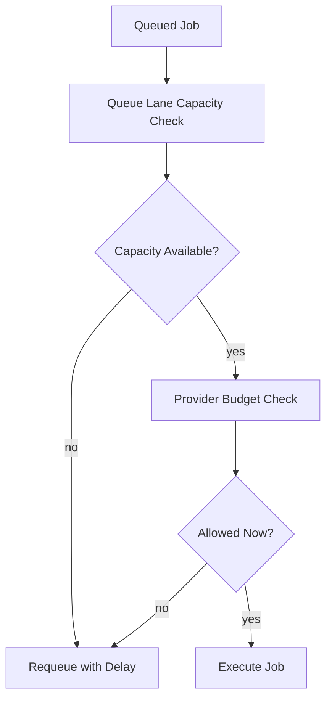

# Rate Limiting Strategy

Rate limiting protects both infrastructure and downstream providers. It should be explicit, layered, and observable.

## Control Layers

1. **Ingress smoothing**: absorb spikes before queue amplification.
2. **Worker concurrency caps**: limit active execution per queue class.
3. **Provider budgets**: enforce per-provider throughput and token/request constraints.
4. **Tenant fairness**: prevent a single tenant from monopolizing shared capacity.

## Policy Behavior Under Saturation

Define one deterministic behavior per lane:

- delay and requeue
- shed low-priority work
- dead-letter non-essential retries after budget exhaustion

## Execution Pattern

## Operational Metrics

- delayed jobs by limiter reason
- provider 429 ratio by provider/model
- queue age during throttling windows
- saturation ratio (active / configured concurrency)
- dropped or shed job counts by class

## Implementation Guidance

- keep limits versioned with config ownership
- separate user-facing lanes from background enrichment lanes
- tune limits with queue age and retry pressure, not CPU alone
- couple retries with jitter to avoid synchronized retry storms
