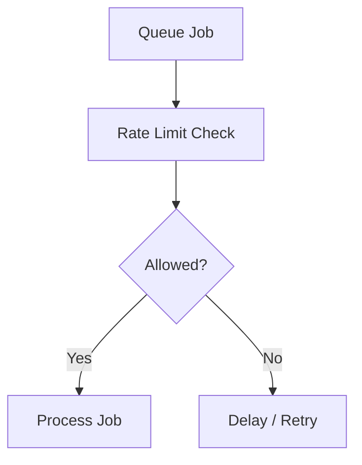

# 🚦 Rate Limiting Strategy

AI automation systems must control request throughput to maintain stability and provider reliability.

---

# ⚡ Goals

The rate-limiting layer protects:

- AI providers
- external APIs
- worker systems
- queue infrastructure

---

# 🧠 Core Strategies

The architecture supports:

- queue throttling
- concurrency caps
- per-tenant limits
- retry delays
- provider-specific limits

---

# 📈 Benefits

Rate limiting improves:

- operational stability
- predictable throughput
- provider reliability
- infrastructure resilience

---

# 🔄 Example Flow

